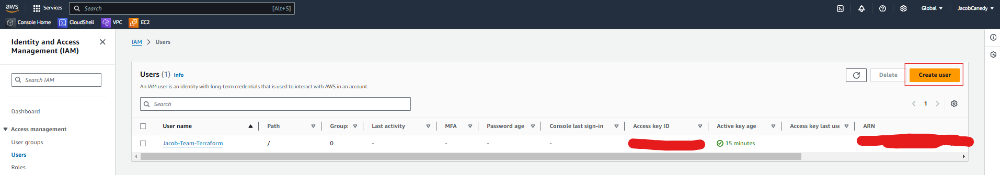
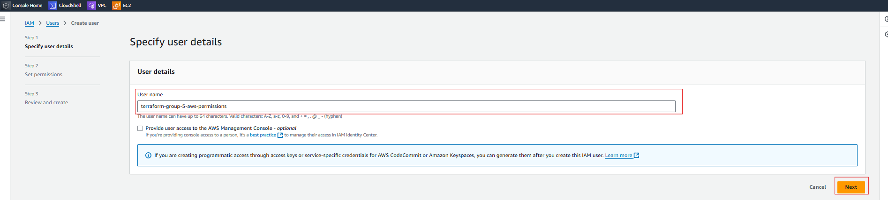
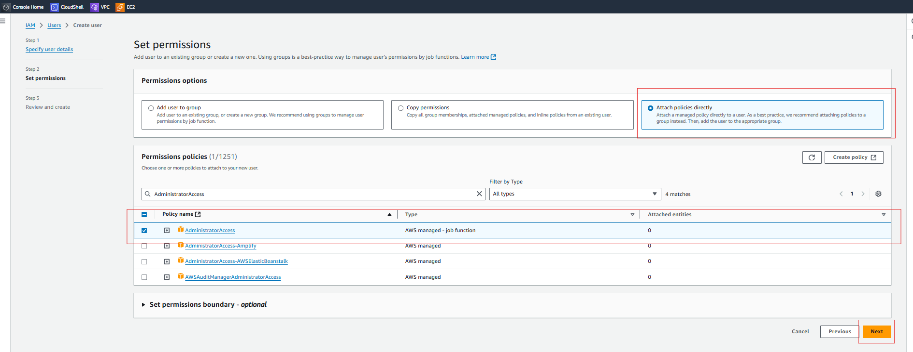
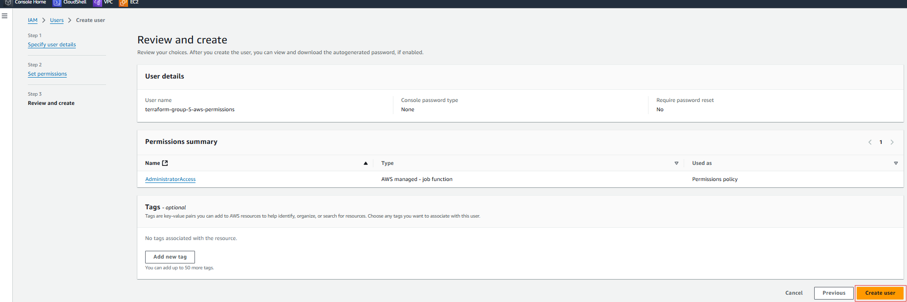
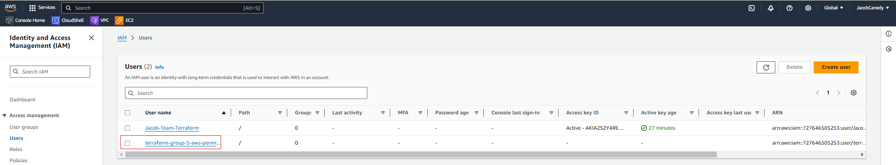
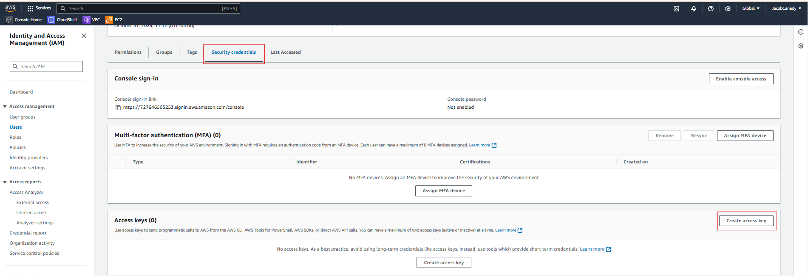
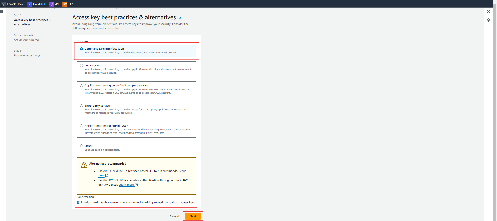
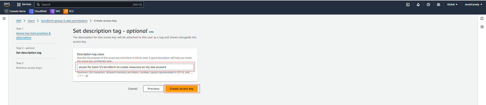
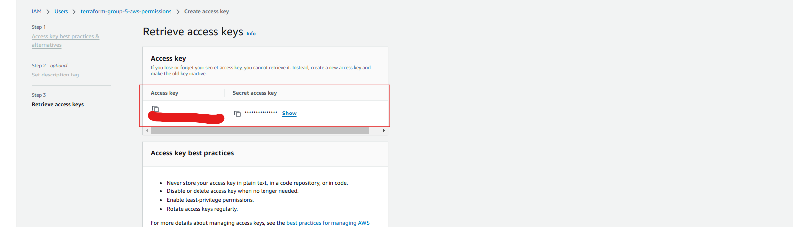

# Food In Sight

  

## Setup:

  

- Create an EC2 instance using the AMI (Team 5 Food Insight AMI)

- SSH into the “ec2-user” account on the EC2 instance

- Run `aws configure` to login to your aws account from this instance using a security key pair if you do not already have a key pair follow [these instructions](#aws-configure) to create new ones.

- Run `git clone git@github.com:SWEN-514-FALL-2024/term-project-2241-swen-514-05-team5.git`

- Run `cd term-project-2241-swen-514-05-team5/`

- Run `git checkout <branch/commit>` (This should be changed to a working commit tag on main that we want to grade instead of latest)

- If you are a developer at this point you can switch to your branch to test that branch instead

- Run `cd deployment`

- Use Vim/vi/nano or your text editor of choice to change the security key to match your account's

security key in "main.tf"

- Run `terraform init`

- Run `terraform plan`

- Run `terraform apply`

- Enter "yes" to allow terraform to launch the new instance

- To shutdown the instance started by terraform run `terraform destroy`

## Testing on API-Step-Lambda branch
- After building with `terraform apply` you can test in the API Gateway console
- Go to the API Gateway console and find `Food-In-Sight-API`
- Select `POST` then `Test`
- In `Request body` type:
`{
	"image_data": "<base64>"
}`
- And replace `<base64>` with the base64 code of a small (<500kb) image

	- You can get the base64 string of an image here: https://base64.guru/converter/encode

	 - For `Datatype` select `Local File`
	 - And `Output Format` select `Plain text -- just the Base64 value`
 - Select `Test` to run the test
 - The Response body should say "Image uploaded to S3 and Step Function triggered."

- Now go to your Step Functions
- Click `LambdaStateMachine`
- Click on the most recent execution
- Click the green `InvokeRekognitionLambda` tag
- Now `State output` should contain the response from Rekognition

## Aws Configure:

  

To get the necessary key and secret after running aws configure in the ec2 instance

  

1. Run `aws configure` in ec2 instance, if you do not have the credentials do the following

2. Go to IAM console

3. Click "Create User"

4. Provide a name, Hit "Next"

5. Attach policies directly and choose "AdministratorAccess", then hit "Next"

6. "Create User"

7. Select Newly Created User

8. Go to Security Credentials. Hit "Create access key"

9. Select "Command Line Interface (CLI)", Confirm confirmation, hit "Next"

10. Enter a description and hit "Create Access Key"

11. Save the access key and secret access key in very very safe place or download csv. The key and secret key is what you will use as answers to the prompt after running aws configure in the ec2 instance.

